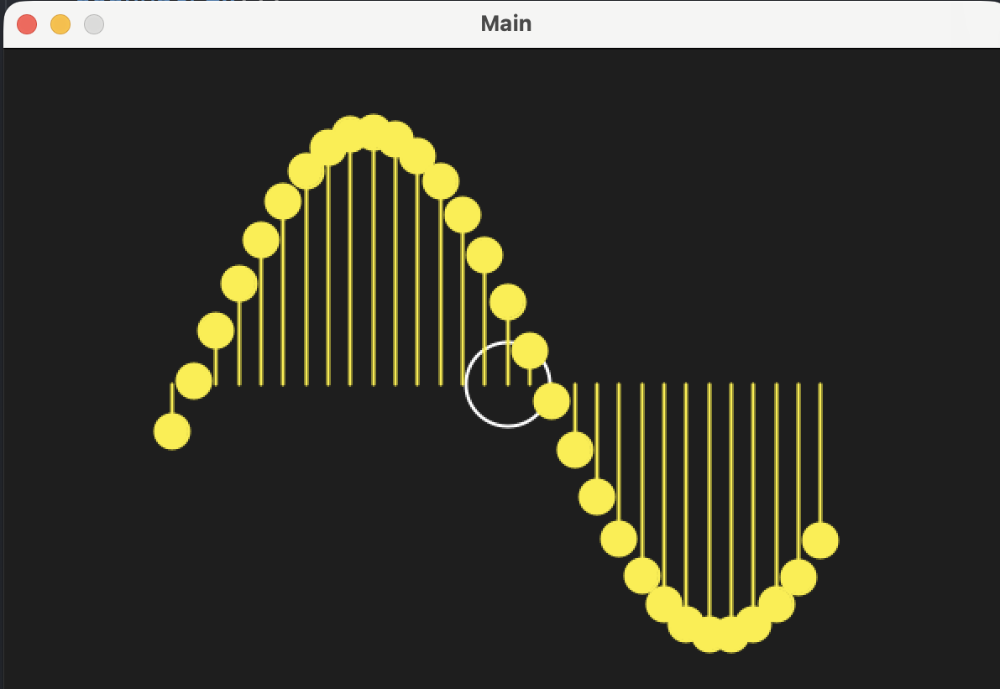

### Overview
- this is a small sin wave simulation, written with processing

### Resources
[The Nature of Code](https://www.youtube.com/watch?v=JLAc9hMtcxk&list=PLRqwX-V7Uu6ZV4yEcW3uDwOgGXKUUsPOM&index=28)
